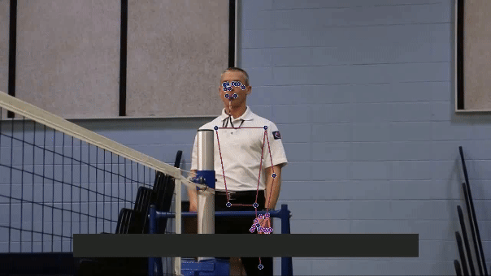
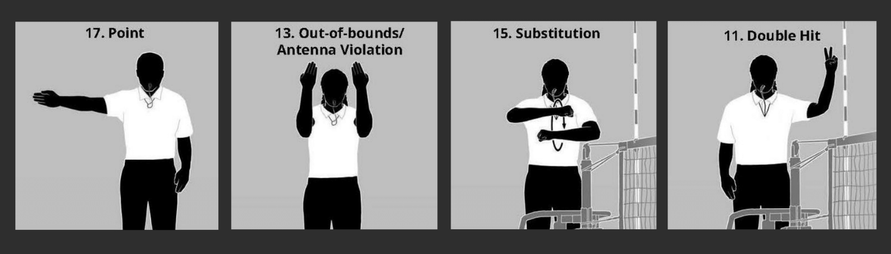
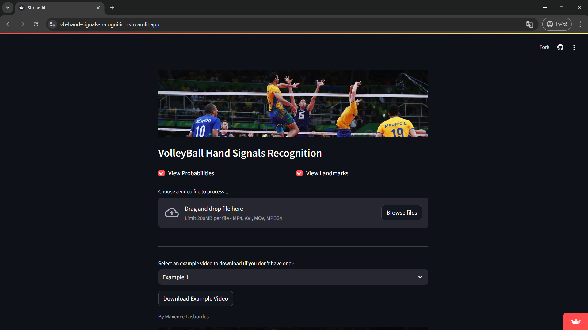

<div align="center">
  
</div>

# Introduction

The goal of this project is to detect, classify, and display the meaning of the hand signals of a volleyball referee. Going further, this project could, for instance, help those unfamiliar with hand signal meanings by providing an AR overlay for live audience displays or automate score updates during matches using the detected signals.

# Information

There is very little data (almost none, actually) available on the internet for such a task because professional volleyball games typically show the entire court and rarely focus on the referee at the right moment. So I had to make **my own dataset** using open cv and mediapipe for hands tracking/pose detection. By extracting and saving the landmarks (key features) of the relevant body parts, I was able to create a dataset with my chosen actions and trained the model using an LSTMs and CNNs because each action is a sequence of frames. Since the data is in the form of vectors associated with the positions of body points detected by MediaPipe, we require significantly less data to train our model and get decent results compared to if we were using images as input.

<div align="center">
  
</div>

# Hand Signals 
<div align="center">
  
</div>

The current trained model detects 6 different positions : 

  - **Point Left :** 1 point is given to the team on the left
  - **Point Right :** 1 point is given to the team on the right
  - **Out of Bounds :** a fault where the ball landed outside the court's boundary lines
  - **Double hit :** a fault where a player contacts the ball twice in succession, or the ball contacts various parts of the player's body consecutively (right hand only)
  - **Substitution :** the process of replacing one player on the court with another player from the bench

The data creation process is time-consuming, because each action is associated with a sequence of frames (and thus with the corresponding key feature values for each frame), so the dataset is small. As a result, I focused on detecting a limited number of actions for now.
_(The results are still good because the key features of the chosen actions are very distinct from one another.)_

# Installation ✨

Use a dedicated environnement to install the librairies.

Clone repo :
```
git clone https://github.com/MaxLSB/Volleyball-Referee-Hand-Signals-Recognition-Model.git
```
Install the requirements for the app:
```
pip install -r requirements.txt
```
# Test 

Detection with your webcam in real time:
```
python main.py
```
_(You can adjust ViewProbabilities and ViewLandmarks' values at the bottom of the file. They are set to 'True' by Default)_

# Streamlit local server 

<div align="center">
  
</div>

Download the 2 example videos:
```
bash downloadExamples.sh
```
Lauching the streamlit local server (download the 2 example videos for a better experience):
```
streamlit run app.py
```

# Train the model with new actions 

Change the actions in the 'utils/config.py' file.

Start the Data Collecting process with your webcam (takes some time):
```
python data.py
```
Train the model:
```
python train.py
```

_(Scripts must be executed from the root folder of the project, be careful about the paths!)_
